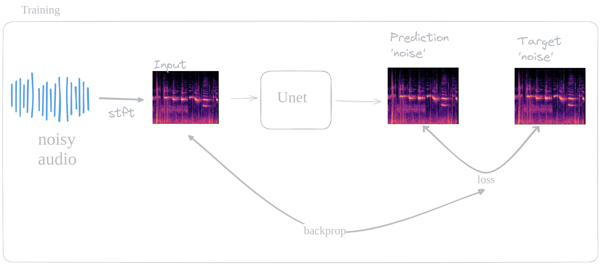
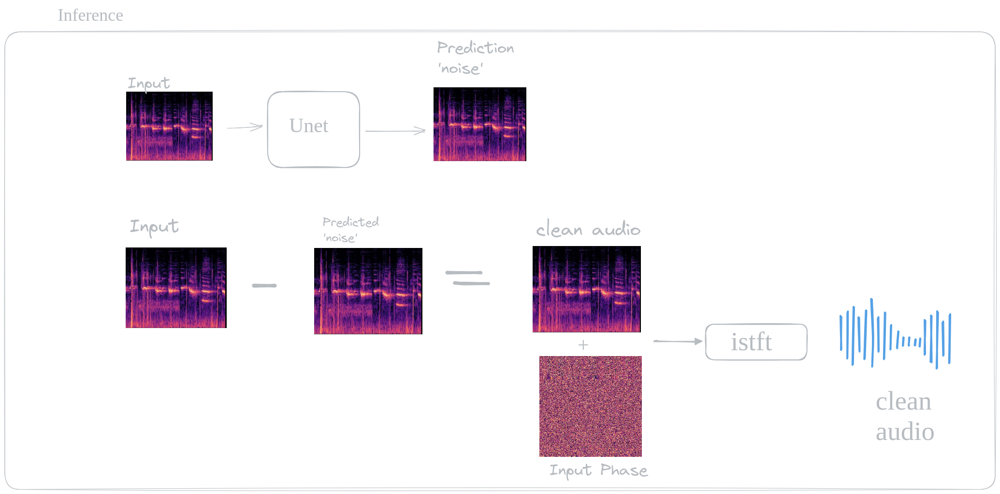

A Speech Enhancement Model that employs U-Net as a DL model that enhances speech quality in audio. The system reduces background noise, improves clarity, and increases intelligibility.

## Technologies Used
 - Python
 - Numpy
 - PyTorch
 - Librosa


## Getting Started

Follow these steps to set up and run your project.

### Installation

1. Create a new virtual environment using conda:

   ```bash
   conda create -n audio python

2. Activate the virtual environment:

   ```bash
   conda activate audio
  
3. Clone the repository

   ```bash
   git clone https://github.com/shulavkarki/Speech-Enhancement.git

4. Navigate to the project repository:

   ```bash
   cd Speech-Enhancement


5. Install the required packages, libraries and frameworks:

    ```bash
    pip install -r requirements.txt

6. Start the Training:

   ```bash
   python trainer.py

6. Infer(Get the non-noise audio):

   ```bash
   python infer.py

## Training



## Inference


## Samples

[Noisy Speech](https://github.com/shulavkarki/shulavkarki.github.io/raw/master/static/audio/noisy_voice.wav)

[Predicted Speech](https://github.com/shulavkarki/shulavkarki.github.io/raw/master/static/audio/voice_pred.wav)

[Clean/True Speech](https://github.com/shulavkarki/shulavkarki.github.io/raw/master/static/audio/voice_true.wav)


